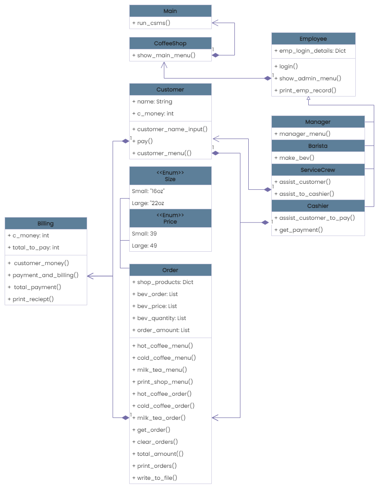

### CS-121-FINAL-PROJECT

Final Project in CS 121 - Advanced Computer Programming
 - Instructor: Dr. Francis Jesmar P. Montalbo

**Group Members**
 - Ilao, Whayne Darlyne |
[@whayneilao](https://www.github.com/whayneilao)
 - Lagajeno, Yeleina |
[@Yeleina](https://www.github.com/Yeleina)
 - Lanot, John Dexter |
[@dexterlanot](https://www.github.com/dexterlanot)
 - Pagcaliwagan, Ivy Nicole |
[@ivynicole](https://www.github.com/ivynicole)

## Self Assesment

The group evaluated the system using the provided grading rubric, which resulted in the following:

| Metric             	| 4 	| 3 	| 2 	| 1 	|
|--------------------	|---	|---	|---	|---	|
| Code Reusability   	|   	|    	| ✔     |   	|
| Maintainability    	|   	| ✔ 	|   	|   	|
| Scalability        	| ✔ 	|   	|   	|   	|
| Execution          	|   	| ✔ 	|   	|   	|
| Originality        	| ✔ 	|   	|   	|   	|
| Overall Impression 	| ✔ 	|   	|   	|   	|

# Coffee Shop Management System

## Project Overview

Because of the current demand for instant coffee or tea, the programmers decided to develop a shopping business system that is related to the shop's day-to-day operations. The Python programming language and Object-Oriented Programming (OOP) concepts were used to create this system. In software, classes and objects and inheritance are used specifically. Furthermore, the programmers used JSON to store employee data, which is retrieved upon logging in, and file handling to keep track of each shop order.

## Prerequisites
Make sure you have installed maskpass before you use the system.

 - [Maskpass](https://pypi.org/project/maskpass/) is a Python library like getpass but with advanced features like masking and reveal/un-reveal. 


### Installation
Use the package manager pip to install maskpass.

```
pip install maskpass
```
# Video Demo

# General Information

### Admin Interface

An employee must input the admin password to gain access to the admin interface. After verification, each staff (Manager, Barista, Service crew, and Cashier) should log in to open the store system for client interaction. The system will only be available for customers when all of the employees have logged in.

### Customer Interface

This interface includes the ordering system and the billing system. Customers can add orders and pay the bill associated with their orders. And a reciept will be generated right after a successful transaction. Also, customer can cancel their order if they wanted to.

# UML Diagram



